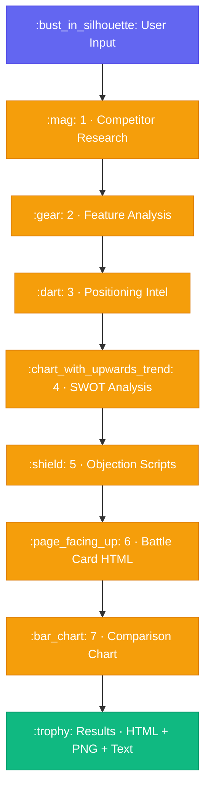

<div align="center">

# :crossed_swords: AI Sales Agent

### *Generate competitive sales battle cards in real-time with 7 specialized AI agents*

[](https://python.org)
[](https://fastapi.tiangolo.com/)
[](https://react.dev/)
[](https://www.typescriptlang.org/)
[](https://tailwindcss.com/)
[](https://ai.google.dev/)
[](https://google.github.io/adk-docs/)

<br/>

Give it a **competitor + your product** and get a complete battle card with positioning strategies, objection handling scripts, SWOT analysis, and visual comparisons — all generated by **7 specialized AI agents**.

<br/>

[Getting Started](#-getting-started) · [Features](#-features) · [API Docs](#-api-endpoints) · [Architecture](#-documentation)

---

</div>

## :bulb: How It Works

The pipeline runs **7 AI agents** in sequence, each building on the previous agent's output:



> [!TIP]
> There's also a standalone **AI Auto-Discovery** agent that scans the web to find competitors when the user doesn't know who they compete against.

---

## :sparkles: Features

| | Feature | Description |
|---|---|---|
| :robot: | **7-Agent Pipeline** | Sequential AI agents, each specialized for one task |
| :globe_with_meridians: | **Live Web Research** | Real-time Google Search grounding for competitor intel |
| :mag_right: | **AI Auto-Discovery** | Leave competitor blank and AI finds them for you |
| :zap: | **Real-time Progress** | Live pipeline tracker showing each agent's status |
| :scroll: | **Battle Card HTML** | Professional styled HTML battle card with download |
| :framed_picture: | **Comparison Chart** | AI-generated visual comparison infographic (PNG) |
| :printer: | **Print / PDF Export** | One-click print or save as PDF from browser |
| :clipboard: | **Raw Text Export** | Plain text download for pasting into docs or slides |
| :bar_chart: | **Dashboard** | View all jobs, statuses, and results in one place |

---

## :hammer_and_wrench: Tech Stack

### Backend

| | Technology | Purpose |
|---|---|---|
|  | [Google ADK](https://google.github.io/adk-docs/) | Multi-agent orchestration framework |
|  | [Gemini 2.5 Flash](https://ai.google.dev/) | LLM for analysis, generation & image creation |
|  | [FastAPI](https://fastapi.tiangolo.com/) | Async REST API server |
|  | [Uvicorn](https://www.uvicorn.org/) | ASGI server |
|  | Google Search (Grounding) | Real-time web research tool |

### Frontend

| | Technology | Purpose |
|---|---|---|
|  | [React 19](https://react.dev/) | UI framework |
|  | [TypeScript 5.9](https://www.typescriptlang.org/) | Type safety |
|  | [Vite 7](https://vite.dev/) | Build tool & dev server |
|  | [Tailwind CSS v4](https://tailwindcss.com/) | Utility-first CSS (Vite plugin) |
|  | [React Router DOM v7](https://reactrouter.com/) | Client-side routing |
|  | [Axios](https://axios-http.com/) | HTTP client |
|  | [Lucide React](https://lucide.dev/) | Icon library |

---

## :open_file_folder: Project Structure

<details>
<summary><b>Click to expand full project tree</b></summary>

```
AISalesAgent/
├── backend/                           # Python backend (FastAPI + Google ADK)
│   ├── main.py                        # FastAPI app entry point
│   ├── agent.py                       # ADK CLI entry point (adk web / adk run)
│   ├── requirements.txt               # Python dependencies
│   ├── .env                           # Backend environment variables
│   ├── .env.example                   # Backend env template
│   │
│   ├── app/
│   │   ├── agents/                    # AI Agent definitions
│   │   │   ├── research_agent.py      # [1] Competitor web research
│   │   │   ├── feature_agent.py       # [2] Product feature analysis
│   │   │   ├── positioning_agent.py   # [3] Positioning intelligence
│   │   │   ├── swot_agent.py          # [4] SWOT analysis
│   │   │   ├── objection_agent.py     # [5] Objection handling scripts
│   │   │   ├── battlecard_agent.py    # [6] HTML battle card generator
│   │   │   ├── chart_agent.py         # [7] Visual comparison chart
│   │   │   ├── discovery_agent.py     # Standalone competitor discovery
│   │   │   ├── pipeline.py            # SequentialAgent wiring (1-7)
│   │   │   └── root_agent.py          # Root orchestrator agent
│   │   │
│   │   ├── api/
│   │   │   └── routes.py              # FastAPI route handlers
│   │   │
│   │   ├── config/
│   │   │   └── settings.py            # App configuration (models, ports, CORS)
│   │   │
│   │   ├── schemas/
│   │   │   └── battlecard.py          # Pydantic request/response models
│   │   │
│   │   └── tools/
│   │       ├── battle_card_html.py    # HTML battle card generator tool
│   │       └── comparison_chart.py    # Gemini image generation tool
│   │
│   ├── output/                        # Generated battle cards & charts
│   └── tests/
│       └── test_pipeline.py
│
├── src/                               # React frontend
│   ├── main.tsx                       # App entry point
│   ├── App.tsx                        # Root component with RouterProvider
│   ├── index.css                      # Tailwind CSS v4 imports + theme
│   │
│   ├── api/
│   │   ├── client.ts                  # Axios instance with interceptors
│   │   └── endpoints.ts               # API endpoint constants
│   │
│   ├── components/
│   │   ├── common/                    # Reusable UI (Button, Input, Loading)
│   │   ├── landing/                   # Landing page sections (8 components)
│   │   └── layout/                    # App layout (Header, Footer, RootLayout)
│   │
│   ├── config/
│   │   └── env.ts                     # Environment variable access
│   │
│   ├── pages/
│   │   ├── Landing/LandingPage.tsx    # Marketing landing page
│   │   ├── Setup/SetupWizard.tsx      # Project config + AI discovery
│   │   ├── Pipeline/PipelinePage.tsx  # Real-time 7-stage progress tracker
│   │   ├── BattleCard/BattleCardPage.tsx  # Result viewer + downloads
│   │   └── Dashboard/DashboardPage.tsx    # All jobs list + stats
│   │
│   ├── routes/index.tsx               # Route definitions
│   ├── services/
│   │   └── battlecard.service.ts      # API service layer
│   ├── types/index.ts                 # TypeScript interfaces
│   └── utils/                         # Utility functions
│
├── docs/                              # Documentation
│   ├── ARCHITECTURE.md                # System design & data flow
│   ├── AGENTS.md                      # Agent specifications
│   ├── API_SPEC.md                    # REST API documentation
│   └── BATTLE_CARD_SCHEMA.md          # Output data structures
│
├── .env                               # Frontend environment variables
├── .env.example                       # Frontend env template
├── package.json
├── vite.config.ts
├── tsconfig.json
└── index.html
```

</details>

---

## :white_check_mark: Prerequisites

> [!IMPORTANT]
> Make sure you have the following installed before proceeding:

| Requirement | Version | |
|---|---|---|
| **Node.js** | `>= 18` |  |
| **npm** | `>= 9` |  |
| **Python** | `>= 3.10` |  |
| **Google API Key** | Gemini API | [](https://aistudio.google.com/apikey) |

---

## :rocket: Getting Started

### 1. Clone the Repository

```bash
git clone <your-repo-url>
cd AISalesAgent
```

### 2. Backend Setup

```bash
# Navigate to backend
cd backend

# Create virtual environment
python -m venv venv

# Activate virtual environment
# Windows:
venv\Scripts\activate
# macOS/Linux:
source venv/bin/activate

# Install Python dependencies
pip install -r requirements.txt

# Set up environment variables
cp .env.example .env
```

Edit `backend/.env` and add your Google API key:

```env
GOOGLE_API_KEY=your-gemini-api-key-here
GOOGLE_GENAI_USE_VERTEXAI=FALSE
```

### 3. Start the Backend

```bash
# From the backend/ directory
python main.py
```

> [!NOTE]
> The API server starts at **http://localhost:8080**. You should see:
> ```
> INFO:     Uvicorn running on http://0.0.0.0:8080 (Press CTRL+C to quit)
> INFO:     Started reloader process
> ```

Verify it's running:

```bash
curl http://localhost:8080/
# Response: {"status":"ok","service":"AI Sales Agent API"}
```

### 4. Frontend Setup

Open a **new terminal** (keep the backend running):

```bash
# From the project root (AISalesAgent/)
npm install

# Set up environment variables
cp .env.example .env
```

The default `.env` points to the backend:

```env
VITE_API_BASE_URL=http://localhost:8080/api
VITE_APP_NAME=AI Sales Agent
```

### 5. Start the Frontend

```bash
npm run dev
```

The dev server starts at **http://localhost:9000** and opens in your browser.

---

## :arrows_counterclockwise: Running Both Together

Open two terminals:

**Terminal 1 — Backend:**

```bash
cd backend
venv\Scripts\activate        # Windows
# source venv/bin/activate   # macOS/Linux
python main.py
```

**Terminal 2 — Frontend:**

```bash
npm run dev
```

| Service | URL | Status |
|---|---|---|
| :art: Frontend | http://localhost:9000 |  |
| :gear: Backend API | http://localhost:8080 |  |
| :book: API Docs (Swagger) | http://localhost:8080/docs |  |
| :heartbeat: Health Check | http://localhost:8080/ |  |

---

## :test_tube: Alternative: Run with Google ADK CLI

You can also run the agent pipeline directly through the ADK CLI (without the FastAPI server):

```bash
cd backend

# Interactive web UI
adk web agent.py --port 8080

# Terminal mode
adk run agent.py

# As an API server
adk api_server agent.py --port 8080
```

---

## :satellite: API Endpoints

All endpoints are prefixed with `/api/battlecard`.

| Method | Endpoint | Description |
|---|---|---|
|  | `/api/battlecard/generate` | Start battle card generation pipeline |
|  | `/api/battlecard/status/{job_id}` | Get pipeline progress (poll this) |
|  | `/api/battlecard/result/{job_id}` | Get completed battle card + infographic |
|  | `/api/battlecard/list` | List all jobs with statuses |
|  | `/api/battlecard/discover-competitors` | AI-discover competitors for a product |

### :arrow_forward: Example: Generate a Battle Card

```bash
# Start pipeline
curl -X POST http://localhost:8080/api/battlecard/generate \
  -H "Content-Type: application/json" \
  -d '{
    "competitor": "Notion",
    "your_product": "Obsidian",
    "target_audience": "Knowledge workers",
    "project_name": "Obsidian",
    "about_project": "A markdown-based note-taking app with local-first storage"
  }'

# Response: {"job_id": "bc_abc123", "status": "queued"}

# Poll for status
curl http://localhost:8080/api/battlecard/status/bc_abc123

# Get result when completed
curl http://localhost:8080/api/battlecard/result/bc_abc123
```

### :mag: Example: Discover Competitors

```bash
curl -X POST http://localhost:8080/api/battlecard/discover-competitors \
  -H "Content-Type: application/json" \
  -d '{
    "project_name": "Obsidian",
    "about_project": "A markdown-based note-taking app with local-first storage",
    "target_audience": "Knowledge workers"
  }'

# Response: {"competitors": [{"name": "Notion", "website": "...", ...}, ...]}
```

---

## :computer: Frontend Pages

| Route | Page | Description |
|---|---|---|
| `/` | :house: Landing Page | Marketing page with features, pricing, testimonials |
| `/setup` | :wrench: Setup Wizard | Enter project details, trigger AI discovery, start pipeline |
| `/pipeline/:jobId` | :hourglass_flowing_sand: Pipeline Tracker | Real-time 7-stage progress with live polling |
| `/battlecard/:jobId` | :crossed_swords: Battle Card Viewer | View HTML battle card + infographic + downloads |
| `/dashboard` | :bar_chart: Dashboard | All jobs list with stats and quick navigation |

---

## :key: Environment Variables

### Frontend (`/.env`)

| Variable | Description | Default |
|---|---|---|
| `VITE_API_BASE_URL` | Backend API base URL | `http://localhost:8080/api` |
| `VITE_APP_NAME` | App display name | `AI Sales Agent` |

### Backend (`/backend/.env`)

| Variable | Description | Required |
|---|---|---|
| `GOOGLE_API_KEY` | Google Gemini API key | :red_circle: **Yes** |
| `GOOGLE_GENAI_USE_VERTEXAI` | Use Vertex AI instead of AI Studio | :white_circle: No (default: `FALSE`) |

---

## :gear: Configuration

Backend settings are in `backend/app/config/settings.py`:

| Setting | Value | Description |
|---|---|---|
| `FAST_MODEL` | `gemini-2.5-flash` | Model for all agents |
| `PRO_MODEL` | `gemini-2.5-flash` | Model for complex tasks |
| `PORT` | `8080` | Backend server port |
| `CORS_ORIGINS` | `localhost:3000, 5173, 9000` | Allowed frontend origins |
| `OUTPUT_DIR` | `backend/output/` | Where generated files are saved |

---

## :toolbox: Scripts

### Frontend

```bash
npm run dev       # Start dev server on port 9000
npm run build     # TypeScript check + production build to dist/
npm run preview   # Preview the production build locally
npm run lint      # Run ESLint
```

### Backend

```bash
python main.py                    # Start FastAPI server (port 8080)
adk web agent.py --port 8080      # Start ADK Web UI
adk run agent.py                  # Run pipeline in terminal
```

---

## :sos: Troubleshooting

<details>
<summary><b>:red_circle: Port already in use</b></summary>

If port 8080 is taken, change it in `backend/app/config/settings.py`:

```python
PORT: int = 8081  # Change to any free port
```

Then update `/.env` to match:

```env
VITE_API_BASE_URL=http://localhost:8081/api
```

</details>

<details>
<summary><b>:yellow_circle: Timeout errors on frontend</b></summary>

AI agent calls (especially discovery) can take 30-60 seconds. The Axios timeout is set to 2 minutes in `src/api/client.ts`. If you still get timeouts, the backend may be overloaded or the Gemini API is slow.

</details>

<details>
<summary><b>:yellow_circle: <code>battle_card_html</code> is null</b></summary>

This happens when the BattleCardGenerator agent returns text instead of calling the HTML tool. The frontend has a fallback that renders the raw AI output as a styled HTML page. You'll still see the content and can download it.

</details>

<details>
<summary><b>:red_circle: CORS errors</b></summary>

Make sure your frontend URL is in the `CORS_ORIGINS` list in `backend/app/config/settings.py`. The defaults cover `localhost:3000`, `localhost:5173`, and `localhost:9000`.

</details>

<details>
<summary><b>:red_circle: Google API key issues</b></summary>

- Get a key from [Google AI Studio](https://aistudio.google.com/apikey)
- Make sure Gemini API is enabled in your Google Cloud project
- The key must have access to `gemini-2.5-flash` model
- Set `GOOGLE_GENAI_USE_VERTEXAI=FALSE` unless you're using Vertex AI

</details>

---

## :books: Documentation

| Document | Description |
|---|---|
| :building_construction: [Architecture](docs/ARCHITECTURE.md) | System design, agent pipeline diagram, data flow |
| :robot: [Agents](docs/AGENTS.md) | Detailed spec for all 7 agents + orchestrator |
| :electric_plug: [API Spec](docs/API_SPEC.md) | REST API endpoints, request/response schemas |
| :card_file_box: [Battle Card Schema](docs/BATTLE_CARD_SCHEMA.md) | TypeScript interfaces for all output types |
| :world_map: [Future Plan](docs/FUTURE_PLAN.md) | 8-phase roadmap from MVP to production SaaS |

---

## :page_with_curl: License

This project is for public distribution.

---

<div align="center">

**Built with :purple_heart: using Google ADK + Gemini + React**

[](.)

</div>
